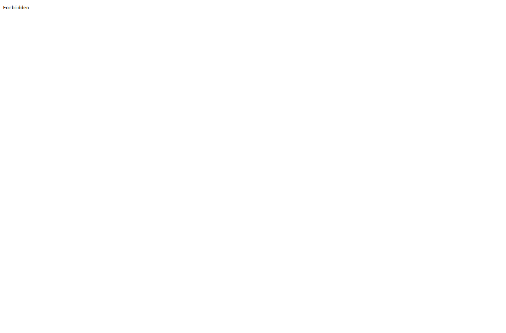

# Browser capture: https://pornhub.com/

- **Requested URL:** `https://pornhub.com`
- **Final URL:** `https://pornhub.com/`
- **Time UTC:** `2026-05-13T10:02:21.897217+00:00`
- **Domain:** `pornhub.com`

## Screenshot

## Offline files

- [Offline HTML](./offline/index.html) ✅
- [MHTML snapshot](./offline/page.mhtml) ✅
- [Original final DOM before rewrite](./offline/final_dom_before_rewrite.html)
- [Offline asset report](./offline/assets.md)

## Page source and links

- [Final DOM](./source/final_dom.html)
- [Visible text](./source/visible_text.txt)
- [All DOM links](./source/all_links.txt)
- [Media/document links](./source/media_links.txt)

## Network / Ajax log

- [Network summary](./network/network.md) ✅
- [Full JSON](./network/network.json)
- [JSONL](./network/network.jsonl)
- Response bodies, when available, are saved in `network/bodies/`.

## Automation and session

- [Automation log](./automation-log.json) ✅
- Session state: `sessions/pornhub_com.json`

## Proxy

- Mode: `fastest-from-file`
- Server: `http://209.97.150.167:3128`
- Source: `proxy-list.json`
- Rank: `1`
- Proxy list ping_ms: `117`

## Stats

- Network requests: `1`
- Offline assets saved: `0`
- Offline assets skipped: `0`
- Offline assets failed: `0`
